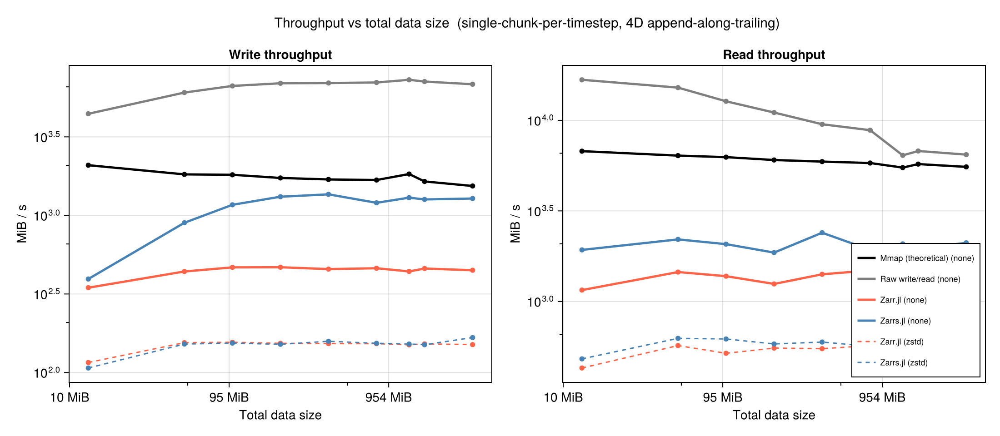
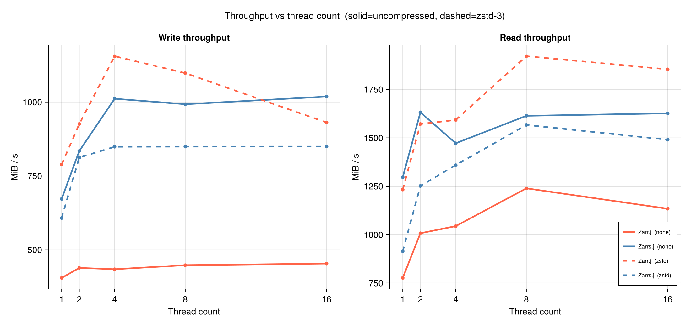

# ZarrBenchmarks

A side-by-side performance comparison of the two main Julia [Zarr](https://zarr.dev)
implementations, plus theoretical I/O baselines, on a sequential append-and-read
workload representative of an Oceananigans-style time-series writer.

The libraries:

- **[Zarr.jl](https://github.com/JuliaIO/Zarr.jl)** — pure-Julia, mature. Full Zarr v2,
  experimental v3. Uses [`ChunkCodecLibZstd`](https://github.com/JuliaIO/ChunkCodecLibZstd.jl),
  [`Blosc.jl`](https://github.com/JuliaIO/Blosc.jl), and friends for codecs.
- **[Zarrs.jl](https://github.com/earth-mover/Zarrs.jl)** — Julia bindings to the
  Rust [`zarrs`](https://github.com/zarrs/zarrs) crate via a C FFI. Zarr v3 first,
  v2 supported. Sharding codec. Internal threadpool via `rayon`. Requires a Rust
  toolchain to build (no JLL yet as of this run).

Plus two non-Zarr baselines to anchor the absolute scale:

- **`Mmap`** — `Mmap.mmap` onto a pre-allocated flat binary file. Writes are
  `arr[:,:,:,t] = buf`, then `Mmap.sync!` + `fsync` at close. Reads are a copy
  out of the mapped array.
- **`raw`** — Plain `open` / `write(io, buf)` / `read!(io, buf)`. No metadata, no
  format, no spec — bytes only.

The Zarr workload writes the same logical 4D array, but per the Zarr spec each
timestep becomes a chunk file with metadata, headers, and (optionally) a
compressed payload.

## Workload

A 4D `Float32` array of shape `(Nx, Ny, Nz, Nt)` is filled one timestep at a
time along the trailing axis (one chunk per timestep, `chunks = (Nx, Ny, Nz, 1)`).
After all `Nt` writes the file is `fsync`-ed and closed. Then the array is
re-opened and every timestep is read back sequentially into a pre-allocated
buffer. This mirrors what `ZarrWriter` in
[Oceananigans.jl](https://github.com/CliMA/Oceananigans.jl) does each call to
`write_output!`.

Sizes swept (single chunk per timestep, 50 timesteps unless noted):

| `Nx × Ny × Nz × Nt` | Total bytes | Per-chunk bytes |
|---|---|---|
| 64 × 64 × 16 × 50    | 12.5 MiB | 256 KiB |
| 128 × 128 × 16 × 50  | 50   MiB | 1 MiB   |
| 128 × 128 × 32 × 50  | 100  MiB | 2 MiB   |
| 256 × 256 × 16 × 50  | 200  MiB | 4 MiB   |
| 256 × 256 × 32 × 50  | 400  MiB | 8 MiB   |
| 256 × 256 × 64 × 50  | 800  MiB | 16 MiB  |
| 512 × 512 × 32 × 50  | 1.56 GiB | 32 MiB  |
| 512 × 512 × 64 × 20  | 1.25 GiB | 64 MiB  |
| 512 × 512 × 64 × 50  | 3.12 GiB | 64 MiB  |

Each (backend, codec, size) configuration runs once as a warm-up (discarded)
and three times for the reported median.

## Results

> **Hardware (this run):** Mac Studio (Apple M2 Ultra), 24 cores, 192 GB RAM,
> internal NVMe (APFS). macOS 24.6.0. Julia 1.12.6. Zarr.jl 0.10.0 (main),
> Zarrs.jl 0.1.0 (main) on the `zarrs` Rust crate 0.23 (built locally with
> `cargo 1.95.0`, `--release` + LTO).

### Data: synthetic, bitrounded-Float32, ~1.85× compressible with zstd-3

The data generator builds a sum of five low-frequency cosines plus a small
noise floor, then bitrounds the Float32 result to 10 mantissa bits — a
synthetic stand-in for the spatially-correlated, broad-but-not-flat-spectrum
data you'd see in real climate / ocean model output. zstd-3 on this field
produces a **~1.85× compression ratio**, matching the typical raw-Float32
ratio reported for real ocean fields. (Earlier versions of this benchmark
used a sawtooth that compressed ~140×; that result was misleading and has
been retired.) See [`bench/common.jl`](bench/common.jl) for the generator,
and the "Why bitround?" note below.

### Headline: optimized Zarr.jl v3 vs Zarrs.jl

The headline result is now Zarr v3, uncompressed, one full chunk per timestep.
`Zarr.jl` here is an experimental optimization branch with:

1. V3 `BytesCodec` bulk-copy encode/decode for native-endian dense arrays.
2. A direct exact-full-chunk overwrite path that encodes the input chunk and
   calls `store_writechunk` without the partial-write scratch-buffer path.

The branch preserves V3 fill-chunk elision semantics and passed
`test/v3_codecs.jl` (`182/182`). Raw CSV:
[`results/v3_optimized_vs_zarrs_full.csv`](results/v3_optimized_vs_zarrs_full.csv).

Per-size median throughput, codec **none** (uncompressed) — MiB/s:

| Size | opt Zarr.jl v3 (W) | Zarrs.jl (W) | W ratio | opt Zarr.jl v3 (R) | Zarrs.jl (R) | R ratio |
|---|---:|---:|---:|---:|---:|---:|
| 12.5 MiB | 382 | 360 | 1.06× | 1056 | 1879 | 0.56× |
| 50.0 MiB | 1489 | 931 | 1.60× | 1509 | 2418 | 0.62× |
| 100 MiB | 2331 | 1145 | 2.04× | 1608 | 2122 | 0.76× |
| 200 MiB | 2974 | 1282 | 2.32× | 1037 | 2177 | 0.48× |
| 400 MiB | 3577 | 1075 | 3.33× | 1484 | 2367 | 0.63× |
| 800 MiB | 3709 | 1285 | 2.89× | 1613 | 1736 | 0.93× |
| 1.6 GiB | 3727 | 1253 | 2.97× | 1517 | 1962 | 0.77× |
| 1.2 GiB | 3828 | 1346 | 2.84× | 1526 | 1855 | 0.82× |
| 3.1 GiB | 3744 | 1253 | 2.99× | 1664 | 1977 | 0.84× |

Reading this table:

1. **Optimized Zarr.jl v3 writes beat Zarrs.jl at every swept size.**
   Write geomean is 2.32× faster; median ratio is 2.84× faster. Large
   full-chunk writes hold around 3.7-3.8 GiB/s.
2. **Zarrs.jl still wins reads overall.** Optimized Zarr.jl v3 read
   throughput is 0.70× of Zarrs.jl by geomean, so read-side parity still
   needs separate work.
3. **The main v3 write gap was not storage.** The exact-full-chunk path
   removes old-chunk reads, scratch-buffer allocation, user-buffer →
   scratch-buffer copies, and channel handoff for the common
   full-timestep-write case.

### Appendix: Zarr.jl-only v2 vs v3

This table keeps the Zarr.jl comparison separate from Zarrs.jl. `PR #272 v2`
and `PR #272 v3` use the branch with the V2 `NoCompressor` bulk-copy path and
shared scratch-buffer allocation improvements. `opt v3` adds the V3
`BytesCodec` and exact-full-chunk optimizations described above.

Per-size median throughput, codec **none** (uncompressed) — MiB/s:

| Size | PR #272 v2 (W) | PR #272 v3 (W) | opt v3 (W) | opt v3 / v2 (W) | PR #272 v2 (R) | PR #272 v3 (R) | opt v3 (R) | opt v3 / v2 (R) |
|---|---:|---:|---:|---:|---:|---:|---:|---:|
| 12.5 MiB | 619 | 306 | 382 | 0.62× | 1268 | 1086 | 1056 | 0.83× |
| 50.0 MiB | 1044 | 640 | 1489 | 1.43× | 1482 | 1127 | 1509 | 1.02× |
| 100 MiB | 931 | 710 | 2331 | 2.50× | 1501 | 369 | 1608 | 1.07× |
| 200 MiB | 1105 | 851 | 2974 | 2.69× | 1348 | 610 | 1037 | 0.77× |
| 400 MiB | 1333 | 909 | 3577 | 2.68× | 961 | 912 | 1484 | 1.54× |
| 800 MiB | 1013 | 741 | 3709 | 3.66× | 1203 | 852 | 1613 | 1.34× |
| 1.6 GiB | 1257 | 893 | 3727 | 2.96× | 1233 | 959 | 1517 | 1.23× |
| 1.2 GiB | 1082 | 791 | 3828 | 3.54× | 1155 | 851 | 1526 | 1.32× |
| 3.1 GiB | 1137 | 852 | 3744 | 3.29× | 1324 | 1072 | 1664 | 1.26× |

The small-size cases are dominated by fixed overhead and noise. From 50 MiB
up, optimized v3 writes are faster than the optimized v2 path, and from
400 MiB up they are roughly 2.7-3.7× faster.

### Historical baseline: original throughput vs data size



The following plot and tables are the older baseline/codec sweep, before the
V3 optimization branch above. They are still useful for codec behavior,
compression tradeoffs, and mmap/raw anchors. Median MiB/s for sequential write
and read, log-log. Solid = uncompressed, dashed = zstd level 3. Mmap and raw
are uncompressed only. Data generation happens **outside** the timed loop
(pre-allocated, one buffer per timestep).

Per-size median throughput, codec **none** (uncompressed) — MiB/s:

| Size | Mmap (W) | Raw (W) | Zarr.jl (W) | Zarrs.jl (W) | Mmap (R) | Raw (R) | Zarr.jl (R) | Zarrs.jl (R) |
|---|---:|---:|---:|---:|---:|---:|---:|---:|
| 12 MiB | 2087 | 4435 | 347 | 394 | 6756 | 16733 | 1156 | 1926 |
| 50 MiB | 1825 | 6053 | 440 | 898 | 6384 | 15153 | 1453 | 2201 |
| 100 MiB | 1814 | 6671 | 467 | **1168** | 6261 | 12732 | 1379 | 2072 |
| 200 MiB | 1731 | 6935 | 468 | 1315 | 6038 | 11037 | 1250 | 1861 |
| 400 MiB | 1694 | 6960 | 455 | 1362 | 5916 | 9511 | 1413 | 2396 |
| 800 MiB | 1680 | 7016 | 461 | 1203 | 5811 | 8820 | 1484 | 1927 |
| 1.6 GiB | 1645 | 7111 | 459 | 1264 | 5733 | 6769 | 1499 | 1952 |
| 3.1 GiB | 1539 | 6840 | 448 | 1281 | 5532 | 6466 | 1572 | 2108 |

Codec **zstd level 3** — MiB/s:

| Size | Zarr.jl (W) | Zarrs.jl (W) | Zarr.jl (R) | Zarrs.jl (R) | on-disk | ratio |
|---|---:|---:|---:|---:|---:|---:|
| 12 MiB | 116 | 107 | 429 | 482 | 7.15 MiB | 1.75× |
| 100 MiB | 156 | 154 | 518 | 621 | 54.6 MiB | 1.83× |
| 800 MiB | 153 | 154 | 571 | 566 | 432 MiB | 1.85× |
| 1.6 GiB | 152 | 150 | 559 | 547 | 853 MiB | 1.88× |
| 3.1 GiB | 151 | **167** | 565 | 610 | 1.67 GiB | 1.88× |

Key reads of the historical tables:

1. **Uncompressed:** Zarrs.jl writes are ~2.5–2.8× Zarr.jl across the sweep
   (~1.2 GiB/s vs ~0.45 GiB/s on large arrays). Reads: Zarrs.jl ~1.3–1.7×.
2. **Compressed (zstd-3):** **the libraries are within 1% of each other**,
   write *and* read. They're both bottlenecked by the same `libzstd` C
   code path. The Julia↔Rust FFI difference contributes nothing once the
   codec is dominant.
3. **Compression slows writes ~3× and reads ~2.5×** on this local NVMe —
   compression CPU costs more time than the 1.85× byte reduction saves.
   This is the expected outcome on fast local storage; the trade flips
   on slow stores (S3, NFS, network filesystems).
4. **Mmap recovers ~25% of raw's write peak; raw approaches the NVMe's
   advertised ~7 GiB/s sequential write ceiling.** Mmap reads (warm
   page cache) are within 30% of raw reads on small data and converge
   to raw on large data.

### Throughput vs thread count



240 MiB workload (`256×256×32×30` Float32), swept over two codecs.
Each (lib, codec, threads) point runs in a fresh Julia subprocess so
`RAYON_NUM_THREADS` (read once at FFI init by Zarrs.jl) and
`JULIA_NUM_THREADS` take effect cleanly.

**No compression — MiB/s:**

| Threads | Zarr.jl W | Zarrs.jl W | Zarr.jl R | Zarrs.jl R |
|---:|---:|---:|---:|---:|
| 1 | 438 | 909 | 988 | 2035 |
| 2 | 448 | 1019 | 1203 | 1614 |
| 4 | 445 | 1184 | 1166 | 1845 |
| 8 | 447 | **1205** | 1284 | **2085** |
| 16 | 428 | 1238 | **1414** | 1945 |

**zstd level 3 — MiB/s:**

| Threads | Zarr.jl W | Zarrs.jl W | Zarr.jl R | Zarrs.jl R |
|---:|---:|---:|---:|---:|
| 1 | 158 | 162 | 504 | 533 |
| 2 | 161 | 161 | 556 | 562 |
| 4 | 163 | 146 | 563 | 540 |
| 8 | 146 | 148 | 531 | 558 |
| 16 | 147 | 148 | 533 | 553 |

Reading these:

- **Zarr.jl uncompressed: flat at ~440 MiB/s write across all thread
  counts.** With no codec to parallelise and the `DirectoryStore`
  running through a sequential channel, threads have nothing to do.
  Reads do scale modestly (~990 → ~1410 MiB/s) — that's chunk-read
  concurrency through Zarr.jl's channel.
- **Zarrs.jl uncompressed: scales ~35% from 1→8 threads** (909 → 1205
  MiB/s writes). `rayon` *is* doing useful work even without a
  compressor — most likely per-chunk file open + write dispatch in
  parallel. Reads scale similarly.
- **zstd-3, both libraries: flat at ~150 MiB/s write, ~550 MiB/s read,
  regardless of thread count.** Neither `rayon` nor Julia threads
  parallelize zstd-level-3 compression at this granularity on a
  per-timestep write pattern. Each `z[:,:,:,t] = buf` call compresses
  exactly one chunk, and the libraries don't queue compress calls
  across timesteps. Threading would help if the user did
  `z[:,:,:,:] = bigarray` (many chunks per call), or if multiple
  processes wrote disjoint slabs of the same store.

### Cross-library compatibility

A small `(32, 32, 16)` Float32 reference array is written with library A and
read with library B for each codec × Zarr-format pair.

|   | v2 → none | v2 → zstd | v2 → blosc | v2 → zlib | v3 → none | v3 → zstd | v3 → blosc | v3 → zlib |
|---|---|---|---|---|---|---|---|---|
| Zarr.jl   → Zarr.jl   | ✓ | ✓ | ✓ | ✓ | ✓ | ✓ | ✓ | ✓ |
| Zarr.jl   → Zarrs.jl  | ✓ | ✓ | ✓ | ✗¹ | ✓ | ✗² | ✓ | ✓ |
| Zarrs.jl  → Zarr.jl   | ✓ | ✓ | ✓ | ✗¹ | ✓ | ✓ | ✓ | ✗³ |
| Zarrs.jl  → Zarrs.jl  | ✓ | ✓ | ✓ | ✗¹ | ✓ | ✓ | ✓ | ✗³ |

- ¹ Zarrs.jl does not support `zlib` for Zarr v2 arrays.
- ² Zarrs.jl rejects Zarr.jl's v3 zstd metadata: the `chunksize` field is
  missing from the codec configuration. A pure-Zarr.jl-written v3 zstd
  store opens fine in Zarr.jl itself but fails in Zarrs.jl. This is the
  only outright cross-library read failure we hit on the major codecs.
- ³ Zarrs.jl doesn't expose `zlib` as a v3 codec name in its current Julia API.

`none`, `blosc`, and zstd-via-Zarrs are clean in both directions and across
both spec versions. (Zarr.jl's v3 still prints an "experimental" warning.)

Raw CSV at `results/compat.csv`.

## "Why bitround?" — a note on the data generator

An earlier iteration of this benchmark used a deterministic sawtooth
`((I + step) % 65537) * 1e-3` as input data. zstd-3 compressed it ~140×,
which made the compressed-write numbers look great — and was completely
misleading for any real use case.

The current generator is a sum of five low-frequency cosines plus a small
white-noise floor, with the final Float32 result **bitrounded to 10
mantissa bits**. Smoothed white noise alone does not compress (we
checked: ratio ~1.1× even after heavy box smoothing) — the mantissa
bits of any `cos`/`rand`-derived Float32 are dense and effectively
incompressible. Real Float32 climate output compresses because the
last ~10 mantissa bits carry numerical noise that the downstream
consumer doesn't actually need; bitrounding makes that explicit by
zeroing them. With 10 keepbits, our generator lands at a ~1.85× zstd-3
ratio — the typical raw-Float32 climate-data ratio.

You can override `ZS_KEEPBITS` (env) to push the ratio around:

| `ZS_KEEPBITS` | zstd-3 ratio |
|---:|---:|
| 23 (no bitrounding) | ~1.09× |
| 16 | ~1.29× |
| 14 | ~1.41× |
| 12 | ~1.59× |
| **10 (default)** | **~1.85×** |
| 8  | ~2.23× |

## Caveats

This is one run on one machine. Several things to keep in mind before
generalising.

1. **APFS write-back caching distorts small writes.** A 192 GB RAM machine
   has plenty of dirty-page budget. We `fsync` all chunk files at close
   to force a real flush, which is included in the wall-time, but small
   per-chunk writes may still benefit from page-cache merging compared
   to a real disk-bound workload. The `raw` write throughput (~7 GiB/s
   on large writes) is right at the M2 Ultra's published NVMe sequential
   write ceiling — believable for warm writes, but a slower disk would
   tell a different story.
2. **Mmap reads are "magic" cached** when the page cache is warm from the
   prior write. Both Zarr libraries read from the same warm cache, so
   the comparison is fair, but absolute mmap read numbers should not be
   read as "what an mmap reader can do on a cold cache".
3. **Single-chunk-per-timestep workload.** This favors the "fat-chunk"
   write pattern. The "many-small-chunks" workload from the original
   plan (W2) is not run here; that would stress per-chunk metadata
   overhead more, where Zarr.jl's channel-based dispatch is likely to
   pay a higher fixed cost.
4. **Threading does nothing for zstd at this granularity.** Per-step
   `z[:,:,:,t] = buf` compresses exactly one chunk; neither library
   queues compress calls across timesteps. A `z[:,:,:,:] = bigarray`
   pattern (or multiple processes writing disjoint slabs) would expose
   chunk-level parallelism that we did not test.
5. **No Python `zarr` baseline.** The plan called for one as a sanity
   check; we didn't run it.
6. **Synthetic data, however bitrounded, is not real data.** A real
   Oceananigans snapshot can have land masks, NaNs, sharp fronts, and
   variable-by-variable entropy that our smooth cosine field doesn't
   capture. The 1.85× ratio is in the right neighbourhood for
   *unmasked, well-conditioned* float fields. Land-masked surface
   fields compress much better.

## Takeaways

- **The headline result is V3 write performance.** With the experimental V3
  optimizations, Zarr.jl writes full uncompressed chunks faster than Zarrs.jl
  at every swept size: 2.32× faster by write geomean, 2.84× by median ratio.
- **The large V3 write win comes from avoiding generic partial-write work.**
  Exact full-chunk overwrites do not need old-chunk reads, scratch buffers,
  user-buffer copies, or channel handoff.
- **V3 reads improved, but Zarrs.jl still wins reads overall.** Optimized
  Zarr.jl v3 is 0.70× of Zarrs.jl by read geomean. The read path needs its own
  optimization pass if parity matters.
- **Relative to Zarr.jl v2, optimized v3 is now the better uncompressed write
  path for medium and large chunks.** From 400 MiB total data upward, the
  optimized v3 write path is roughly 2.7-3.7× faster than the PR #272 v2 path.
- **The older zstd and threading conclusions are still useful, but historical.**
  zstd-3 remains codec-bound in the baseline sweep, while the V3 optimization
  work here targeted uncompressed full-chunk writes.
- **Cross-library round-trip remains mostly solid** for codec `none`, `blosc`,
  and zstd in both v2 and v3, except the Zarr.jl-written-v3-zstd → Zarrs.jl
  `chunksize` metadata mismatch noted above. `zlib` support remains uneven.

## How to reproduce

Prereqs: Julia 1.10+, a Rust toolchain (for Zarrs.jl), ~10 GB free disk.

```bash
git clone https://github.com/glwagner/ZarrBenchmarks
cd ZarrBenchmarks

# Clone the libraries under benchmark
git clone https://github.com/JuliaIO/Zarr.jl
git clone https://github.com/earth-mover/Zarrs.jl

# (One-time) install Rust if you don't have it:
#   curl --proto '=https' --tlsv1.2 -sSf https://sh.rustup.rs | sh -s -- -y
export PATH="$HOME/.cargo/bin:$PATH"

# Develop both libraries into the benchmark environment
julia --project=. -e 'using Pkg; Pkg.develop(path="Zarr.jl"); Pkg.develop(path="Zarrs.jl"); Pkg.instantiate()'

# Build the zarrs_jl Rust shared library (one time)
julia --project=. Zarrs.jl/deps/build.jl

# Run the full sweep + plots (~3 min on an M2 Ultra)
julia --project=. bench/run_all.jl

# Or run pieces individually:
julia --project=. bench/bench_sequential.jl
julia --project=. bench/bench_threads.jl
julia --project=. bench/bench_compat.jl
julia --project=. bench/plot_results.jl
```

### Layout

```
bench/
  common.jl           – Workload type, mmap/raw backends, helpers
  backends.jl         – Zarr.jl & Zarrs.jl backends behind one API
  bench_sequential.jl – size sweep, write + read sequential
  bench_threads.jl    – thread-count sweep (subprocesses, fresh ENV)
  bench_compat.jl     – cross-library round-trip pass/fail table
  plot_results.jl     – CairoMakie plots from the CSVs
  run_all.jl          – convenience driver

results/
  sequential.csv      – one row per (backend, codec, size, repeat)
  threads.csv         – one row per (backend, threads, repeat)
  compat.csv          – one row per (writer, reader, codec, zarr_format)
  *.png               – plots

Project.toml          – pins BenchmarkTools, CairoMakie, Zarr, Zarrs
zarr_libraries_benchmark_plan.md – the original plan
```

### Environment variables understood by the benches

`bench_sequential.jl`:
- `ZS_SIZES`   — `"Nx,Ny,Nz,Nt;Nx,Ny,Nz,Nt;…"` (override the size list)
- `ZS_CODECS`  — `"none,zstd,blosc,zlib"`
- `ZS_REPEATS` — integer (default 3)
- `ZS_BACKENDS` — subset of `{mmap,raw,zarrjl,zarrsjl}`

`bench_threads.jl`:
- `ZS_SHAPE`    — `"Nx,Ny,Nz,Nt"` (default `256,256,32,30`)
- `ZS_CODEC`    — default `zstd`
- `ZS_THREADS`  — `"1,2,4,8,16"`
- `ZS_BACKENDS` — default `"zarrjl,zarrsjl"`
- `ZS_REPEATS`  — integer (default 3)
